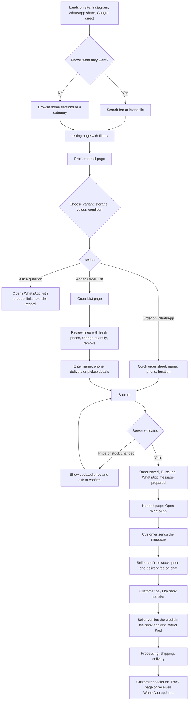
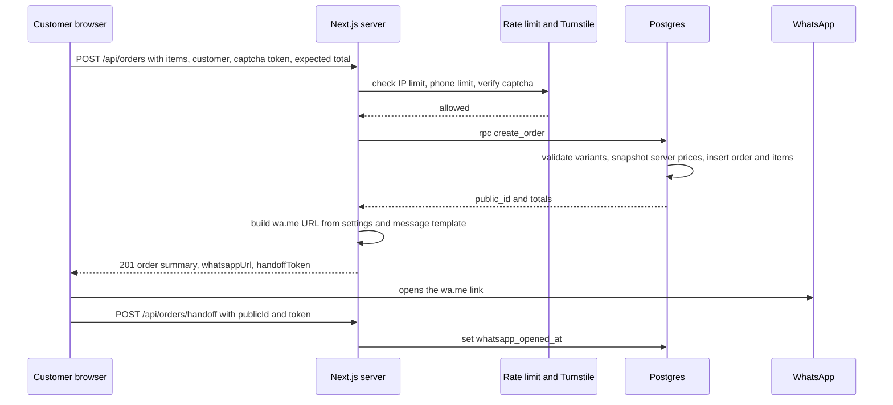
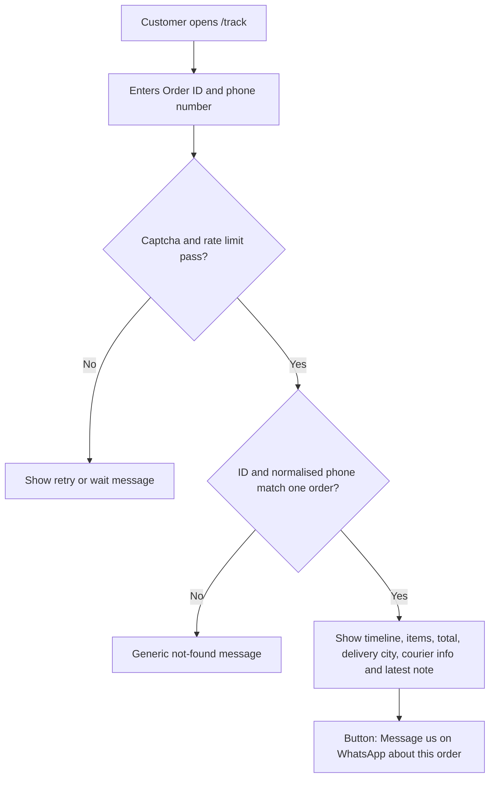
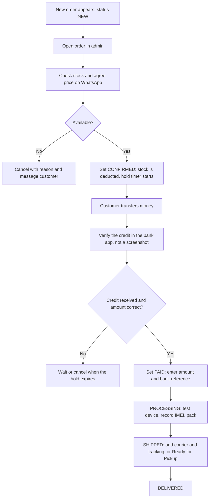
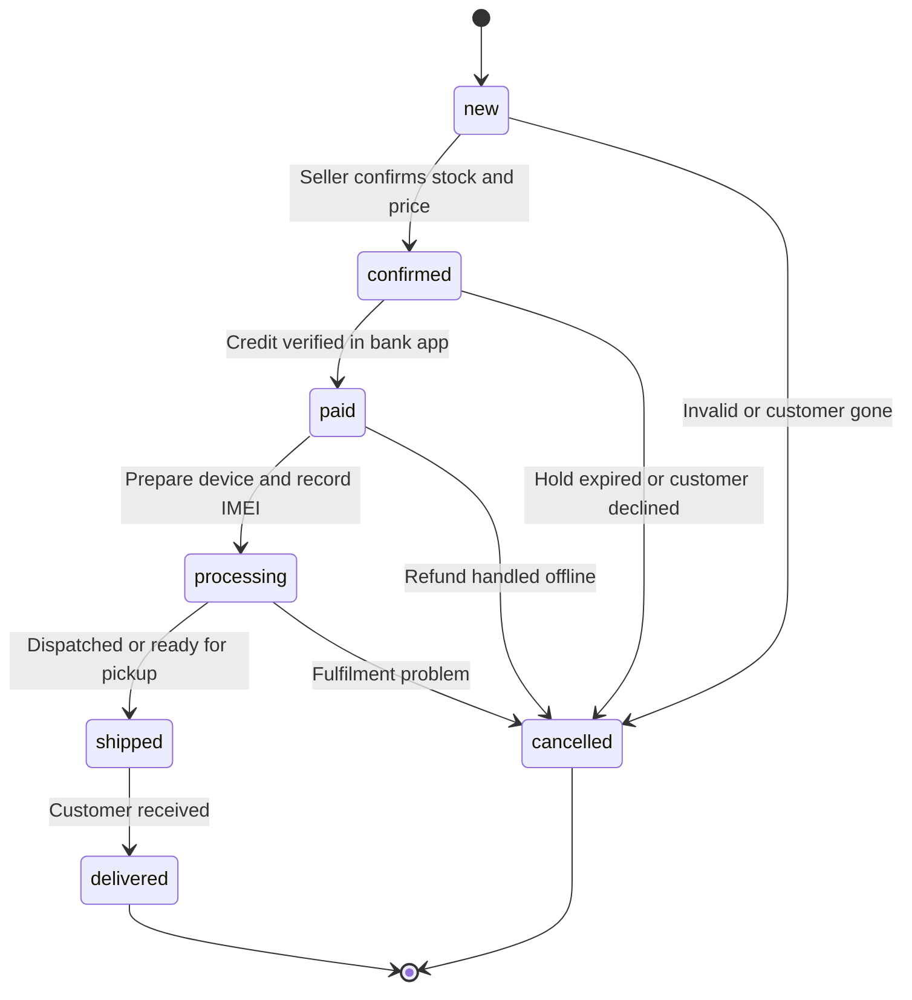
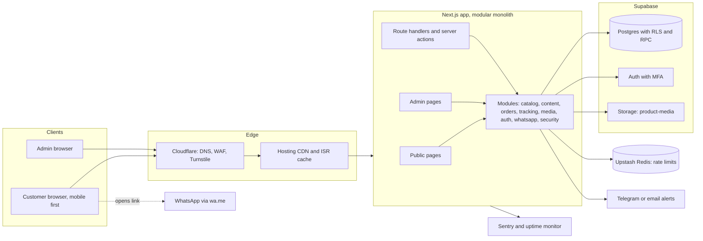
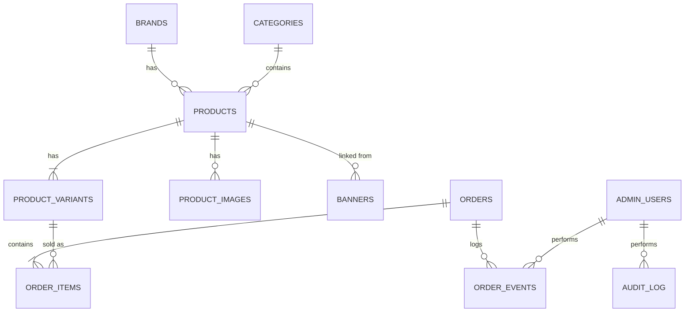
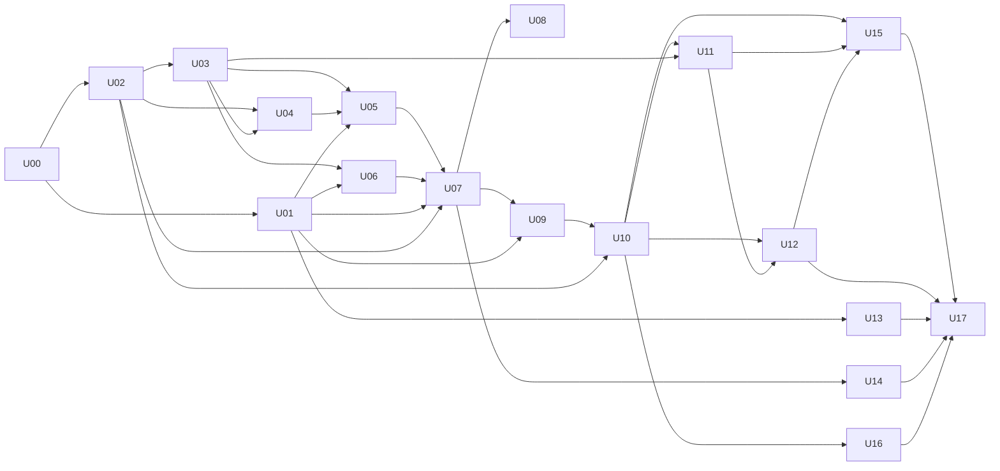

# Keraunous Tech Store: Build Blueprint

**User flow, architecture, system design and build units** Version 1.0 · 6 Oct 2026 · Scope: showcase website + WhatsApp ordering + admin panel · Market: Nigeria (₦)

---

## How to use this document

| Sections | What they give you |
| --- | --- |
| 1 to 5 | **What** we are building, for **whom**, and every **user flow** |
| 6 to 9 | **How** it is built: architecture, database, API contracts, business rules |
| 10 | The system split into **18 build units** (U00 to U17), each with scope, interfaces and acceptance criteria |
| 11 | **How the units connect**: dependency graph, build waves, integration checkpoints |
| 12 to 16 | Security, performance, testing, operations, launch checklist |

Build the units in the order shown in Section 11. Each unit has a "Definition of done", so you always know when to move on.

---

## 1. Product definition

### 1.1 What we are building

Keraunous is a **phone and gadget showcase website**. Visitors browse products, pick a variant (storage, colour, condition), and send a structured order to the seller on **WhatsApp**. The website saves every order first (so nothing is lost), hands the customer to WhatsApp with a prefilled message, and later lets the customer **track** the order. The owner and staff manage products, prices, content, and orders from a protected **admin panel**.

There are no online payments in v1. The customer pays by bank transfer after the seller confirms stock and price on WhatsApp.

### 1.2 Goals and non-goals

| Goals (v1) | Non-goals (v1) |
| --- | --- |
| G1. Fast, beautiful mobile-first catalogue | Online card/transfer payments (Paystack later) |
| G2. Turn visits into WhatsApp conversations with a complete, structured order | Customer accounts and login |
| G3. Keep a record of every order and its status | Installments / EMI |
| G4. Let customers track their order | Reviews and ratings |
| G5. Owner updates products and prices in minutes, no developer needed | Coupon codes (deferred, see Section 16) |
| G6. Resist price tampering, spam orders, scraping and scams | Automatic shipping rates |
| G7. Load quickly on mid-range phones and mobile data | Multi-vendor marketplace, native app |

### 1.3 Key decisions (and why)

| # | Decision | Reason |
| --- | --- | --- |
| D1 | **No customer accounts** | Fewer features to break, no passwords to leak, faster ordering. Tracking uses order ID + phone number. |
| D2 | **Save the order first, then open WhatsApp** | You get a record even if the customer never sends the message; the order ID links chat and admin. |
| D3 | **Prices are computed on the server only** | The browser can never set a price. Client prices are display-only. |
| D4 | **Payment happens off-site by bank transfer; the seller verifies the credit in the bank app** | Screenshots and fake alerts are the main scam. The rule is: no credit in your own bank app, no release. |
| D5 | **One Next.js app, organised into modules (modular monolith)** | Simple to deploy and debug for a small team, still cleanly split into units. |
| D6 | **Supabase Postgres with Row Level Security (RLS)** | Real transactions and constraints, built-in admin auth with MFA, file storage in one place. |
| D7 | **Money stored as integer Naira** | No floating-point errors. (Switch to kobo if you ever need fractions.) |
| D8 | **Stock is deducted when an order becomes CONFIRMED, restored on cancel** | Matches how WhatsApp selling works: the seller commits stock when they confirm. |
| D9 | **Admin requires email + password + TOTP MFA** | The admin panel controls prices and your WhatsApp number, so it is the highest-value target. |
| D10 | **No fake social proof** (no invented customer counts, review counts or ratings) | It misleads customers, damages trust when noticed, and can create legal exposure under consumer-protection rules. |
| D11 | **All order mutations go through database functions (RPC)** | The status machine and stock rules cannot be bypassed by a buggy screen. |

### 1.4 Success metrics

| Metric | Target |
| --- | --- |
| Mobile LCP (75th percentile, 4G) | ≤ 2.5 s |
| Order created → WhatsApp opened | ≥ 85% |
| Time for staff to publish a new product | ≤ 5 minutes |
| Order creation API p95 | ≤ 800 ms |
| Orders with a total that differs from the sum of their items | 0 |
| Unhandled error rate | \< 0.5% of requests |

---

## 2. Corrections to the current homepage design

Your Stitch homepage is a strong base. These items conflict with the WhatsApp showcase model, with Nigeria, or with honesty/trust, so fix them (in Stitch or in code) before building.

| # | Element in current design | Change | Why |
| --- | --- | --- | --- |
| 1 | All prices in `$` ("Starting at $999", `$1,199`) | Show `₦` with thousands separators, e.g. `₦1,650,000`. Data-driven. | Local market |
| 2 | Hero text: "Free engraving and 0% EMI available" | Remove | No installments; engraving not offered |
| 3 | Trust bar: "Free Shipping on orders over $99" | "Nationwide Delivery" (details on WhatsApp) | No shipping-fee logic in v1 |
| 4 | Trust bar: "Secure Payment, 100% protected checkout" | "Genuine Products" or "Inspect Before You Pay" (only if you really offer it) | There is no online checkout |
| 5 | Footer: "Trusted by 2M+ customers worldwide" | **Remove** unless literally true | False claims destroy trust |
| 6 | Star ratings with counts (4.9 (2.3k)) on every card | **Remove** until you have real reviews | Fabricated reviews |
| 7 | Cart icon with red badge "3" | Rename to **Order List** (list icon, count badge) | No cart/checkout |
| 8 | User avatar "J" in navbar | Remove | No accounts |
| 9 | Heart icon on product cards | Keep. Works as a local wishlist (saved on the device). | Useful, no account needed |
| 10 | "Add to Cart" buttons | **Order on WhatsApp** (primary) and **Add to List** (secondary, on detail page) | Core model |
| 11 | Flash sale strip: "Extra 10% off with code KERA10" | Remove the code. Keep the countdown only for real, admin-scheduled sales. | No coupon system in v1 |
| 12 | "Stay Connected" email newsletter | Change to **"Join our WhatsApp Channel / Broadcast"** with a join button | Your audience is on WhatsApp; avoids storing emails |
| 13 | Footer payment icons and "Visa · Mastercard · PayPal · Apple Pay" | Remove. Optionally: "Pay by bank transfer to Keraunous only". | Not accepted |
| 14 | Brand tiles use generic icons | Use real brand logos, add Tecno / Infinix / itel if you stock them | Brands your market actually buys |
| 15 | Every product card uses the same phone image | Real photo per product and per colour, consistent background | Trust and conversion |
| 16 | Missing | Add: floating WhatsApp button, store address and hours (if physical), WhatsApp number in header/footer, "Verify our official accounts" link | Anti-impersonation and convenience |
| 17 | Footer "Support Center" | Replace with "Contact on WhatsApp" | You have one support channel |
| 18 | Hero is hard-coded to iPhone 16 Pro | Hero slides are driven by the admin (banners), linked to real products | Reuse and accuracy |

---

## 3. Actors and permissions

| Actor | Who | Authentication |
| --- | --- | --- |
| **Visitor / Customer** | Anyone on the website | None |
| **Owner** | Business owner | Email + password + TOTP MFA |
| **Staff** | Employees you invite | Email + password + TOTP MFA |
| **System** | Scheduled jobs, webhooks (later) | Secret keys |

### Permission matrix (admin)

| Capability | Staff | Owner |
| --- | --- | --- |
| View dashboard, products, orders | ✅ | ✅ |
| Create / edit / archive products and variants | ✅ | ✅ |
| Edit stock | ✅ | ✅ |
| Upload and reorder images | ✅ | ✅ |
| Edit banners, flash sale, homepage content | ✅ | ✅ |
| Change order status (new → confirmed → paid → processing → shipped → delivered) | ✅ | ✅ |
| Cancel an order **before** payment | ✅ | ✅ |
| Cancel an order **after** payment was confirmed | ❌ | ✅ |
| Adjust an order line price (negotiated price) | ✅ (with reason) | ✅ |
| Apply bulk price changes | ❌ (can preview) | ✅ |
| Change WhatsApp number, hold hours, templates (Settings) | ❌ | ✅ |
| Manage staff accounts | ❌ | ✅ |
| View audit log | ❌ | ✅ |
| Export orders (CSV) | ❌ | ✅ |
| Permanently delete anything | ❌ | ✅ (rarely; archive instead) |

---

## 4. Sitemap and page inventory

| Route | Page | Rendering | Main data | Unit |
| --- | --- | --- | --- | --- |
| `/` | Home | Static + on-demand revalidation | banners, campaigns, featured products, deals, brands, settings | U07 |
| `/shop` | All products with filters | Server-rendered, cached by URL | `v_product_cards` | U07, U08 |
| `/category/[slug]` | Category (Smartphones, Tablets...) | ISR | same | U07 |
| `/brand/[slug]` | Brand page | ISR | same | U07 |
| `/new-arrivals` | Newest published | ISR | same | U07 |
| `/best-sellers` | Products flagged best seller | ISR | same | U07 |
| `/deals` | Items on sale (effective price below normal) | ISR | same | U07 |
| `/product/[slug]` | Product detail (`?v=` selects variant) | ISR | product, variants, images, specs | U07 |
| `/wishlist` | Saved items (device only) | Client-rendered | localStorage + resolve API | U09 |
| `/order-list` | Order List (the "cart") + customer details form | Client-rendered | localStorage + resolve API | U09, U10 |
| `/order/sent` | WhatsApp handoff page | Client-rendered | sessionStorage from create response | U10 |
| `/track` | Track order form + result | Client + API | `/api/track` | U12 |
| `/about`, `/contact`, `/faq` | Trust pages | Static | content | U13 |
| `/delivery`, `/returns-warranty`, `/privacy`, `/terms`, `/how-to-order`, `/verify-us` | Policy and trust pages | Static | content | U13 |
| `/admin/login` | Admin sign-in + MFA | Dynamic | Supabase Auth | U03 |
| `/admin` | Dashboard | Dynamic | orders, stock | U11 |
| `/admin/products`, `/new`, `/[id]` | Product list and editor | Dynamic | catalogue tables | U05 |
| `/admin/brands`, `/admin/categories` | Taxonomy | Dynamic |  | U05 |
| `/admin/orders`, `/admin/orders/[id]` | Order management | Dynamic | orders | U11 |
| `/admin/content` | Banners, flash sale, trust bar, homepage | Dynamic | content tables | U06 |
| `/admin/settings` | Settings (owner) | Dynamic | `site_settings` | U06 |
| `/admin/staff`, `/admin/audit` | Staff and audit (owner) | Dynamic |  | U03, U15 |
| `/admin/tools/bulk-price` | Bulk price update (owner) | Dynamic |  | U05 |
| `/api/*` | See Section 8 | Dynamic |  | various |
| `/sitemap.xml`, `/robots.txt` | SEO | Generated |  | U14 |

Admin pages are `noindex`, never cached, and never linked from the public site.

### 4.1 Homepage sections mapped to data (from your design)

| Section in design | Data source | Admin control |
| --- | --- | --- |
| Navbar (Home, Shop, Categories, New Arrivals, Best Sellers, Deals, Contact) | static config + categories | Categories in admin |
| Search icon | `/api/search` | n/a |
| Heart icon | local wishlist | n/a |
| Order List icon + badge | local list | n/a |
| Hero carousel ("NEW ARRIVAL", headline, CTA, "Starting at") | `banners` where type = hero (linked to product) | Content → Banners |
| Trust bar (4 items) | `site_settings.trust_bar` | Settings / Content |
| Popular Smartphones (4 cards) | products flagged featured, ordered by `featured_rank` | Product → Featured toggle + rank |
| Limited Time Offer promo banner | `banners` where type = promo | Content → Banners |
| Shop by Brand (6 tiles) | active brands by `sort_order` | Brands |
| Best Deals (4 cards, discount badge, old price) | products with an active sale, sorted by discount % | Variant sale price + dates |
| Flash Sale strip with countdown | `campaigns` (active, `ends_at` in future) | Content → Flash sale |
| "Stay Connected" | `site_settings.whatsapp_channel_url` | Settings |
| Footer | settings + categories + static links | Settings |

---

## 5. User flows

### 5.1 Customer journey (end to end)



### 5.2 Order creation (system sequence)



### 5.3 Edge cases and expected behaviour

| Situation | Expected behaviour |
| --- | --- |
| Customer's cached page shows an old price | Order request carries `expectedTotalNgn`. If it differs from the server total, respond `409 PRICE_CHANGED` with fresh lines; the UI shows "Prices updated, please review" and the customer re-confirms. |
| Variant sold out between viewing and ordering | `409 OUT_OF_STOCK` listing the affected lines; customer can remove them or message the seller. |
| Flash sale ends while the customer is filling the form | Server uses `effective_price()` with `now()`; mismatch triggers `PRICE_CHANGED`. |
| Double tap on Submit / slow network retry | Same `idempotencyKey` returns the existing order, never a duplicate. |
| WhatsApp not installed / desktop without WhatsApp | Handoff page offers **Copy message**, **Open WhatsApp Web**, and a QR code of the wa.me link. |
| Customer closes the tab before sending the message | Order exists as NEW with `whatsapp_opened_at` empty; admin sees it flagged "Not yet contacted" and may message the customer first. |
| Invalid phone number | Inline error; accepted: `0803...`, `803...`, `+234803...`, with spaces/dashes. Normalised to `+234...`. |
| localStorage blocked (private mode) | In-memory fallback for the session; banner explains the list will not persist. |
| Product unpublished while in someone's Order List | Resolve API drops it and shows a notice "No longer available". |
| Customer enters wrong phone on tracking | Generic "We couldn't find an order with those details". |
| Bot hammers order or track endpoints | `429 RATE_LIMITED`, Turnstile challenge, blocklist entry by admin. |
| Admin loses the phone with the MFA app | Owner resets staff MFA; owner uses recovery codes stored offline. |

### 5.4 Tracking flow



### 5.5 Admin flows

**A. Add a new product (target: under 5 minutes)**

1. Admin → Products → **New product**.
2. Basics: name, brand, category, short description, long description, badge.
3. Specs: screen, chip, RAM, camera, battery, network (5G/4G), OS.
4. Variants: add rows (storage, colour, condition, price, optional old price, stock, warranty months).
5. Images: drag several photos; they are compressed to WebP in the browser, uploaded, reordered; pick the primary; add alt text.
6. Click **Preview** (opens the real product page in draft mode).
7. **Publish**. The site revalidates the affected pages within seconds.

**B. Handle an incoming order**



**C. Change prices after an exchange-rate move (owner)**

1. Admin → Tools → Bulk price.
2. Choose scope (brand, category, condition, or selected products) and operation (increase/decrease by %, or upload CSV).
3. Choose rounding (e.g. nearest ₦500 or ₦1,000).
4. Review the **preview table** (old → new, per variant).
5. Confirm. The change runs in one transaction, is written to the audit log, and the site revalidates.

**D. Run a flash sale**

1. Set `sale_price` with start and end time on the variants (or use bulk tool).
2. Admin → Content → Flash sale: set title, end time, link; activate.
3. The countdown on the site uses the **server clock**; prices revert automatically at the end time, because the server computes the effective price.

### 5.6 Order status machine



| From | To | Who | Side effects |
| --- | --- | --- | --- |
| new | confirmed | Staff, Owner | **Deduct stock** for each line (fails if insufficient); set `confirmed_at`; start hold timer |
| new | cancelled | Staff, Owner | Reason required; no stock change |
| confirmed | paid | Staff, Owner | Requires payment amount and optional bank reference; amount must be ≥ order total or an override reason is given; set `payment_confirmed_at` |
| confirmed | cancelled | Staff, Owner | **Restore stock**; reason required |
| paid | processing | Staff, Owner | none |
| paid | cancelled | **Owner only** | Restore stock; reason required; refund tracked offline and noted |
| processing | shipped | Staff, Owner | Requires IMEI on every phone line; courier/tracking (delivery) or pickup note |
| processing | cancelled | **Owner only** | Restore stock; reason |
| shipped | delivered | Staff, Owner | set `delivered_at` |

Every transition writes an `order_events` row (who, when, from, to, note). `delivered` and `cancelled` are terminal; returns after delivery are handled as a separate process in a later release.

**Customer-facing labels**

| Internal status | Customer sees |
| --- | --- |
| new | Order received |
| confirmed | Confirmed, awaiting payment |
| paid | Payment received |
| processing | Preparing your order |
| shipped | On the way (delivery) / Ready for pickup (pickup) |
| delivered | Delivered |
| cancelled | Cancelled |

---

## 6. System architecture

### 6.1 Component view



### 6.2 Layers inside the app

| Layer | Responsibility | Rule |
| --- | --- | --- |
| **UI** (`app/`, `components/`) | Pages, forms, interactions | No business rules, no direct database calls except through module functions |
| **Modules** (`modules/<name>/`) | Business logic per domain; each exposes a public API through `index.ts` | Modules import each other **only** through `index.ts` |
| **Contracts** (`lib/contracts/`) | Zod schemas and TypeScript types shared by UI, API and modules | Single source of truth for request/response shapes |
| **Data** (`db/`, `modules/*/repo.ts`) | SQL migrations, RLS, RPC functions, typed queries | Only repos talk to Supabase |
| **Platform** (`lib/`) | env, logger, money, phone, ids, rate-limit, result envelope | Pure and unit-tested |

### 6.3 Technology choices

| Concern | Choice | Why | Alternative |
| --- | --- | --- | --- |
| Framework | **Next.js (App Router) + TypeScript (strict)** | SSR/ISR for SEO and speed, one codebase for site, admin, API | Astro + separate API |
| Styling | **Tailwind CSS** + design tokens | Fast to match the Stitch design | CSS modules |
| Forms/validation | **React Hook Form + Zod** | Same schema validates client and server |  |
| Database | **Supabase Postgres** | Transactions, constraints, RLS, RPC | Neon + custom auth |
| Admin auth | **Supabase Auth** (invite-only, TOTP MFA) | Built-in, audited, MFA ready | Auth.js |
| File storage | **Supabase Storage** + browser-side WebP compression + `next/image` | One vendor, simple | Cloudinary |
| Rate limiting | **Upstash Redis + @upstash/ratelimit** | Works on serverless | Postgres counters |
| Bot protection | **Cloudflare Turnstile** | Free, light, privacy-friendly | hCaptcha |
| Hosting | **Vercel** for the app (use a paid plan for a business site; free tiers can have non-commercial terms, so verify current terms) | Easy previews and ISR | Netlify, VPS with Docker |
| Errors | **Sentry** | Stack traces and alerts |  |
| Uptime | UptimeRobot / Better Stack on `/api/health` |  |  |
| Analytics | **Plausible or Umami** (cookieless) or GA4 | Light, privacy-friendly |  |
| Alerts | **Telegram bot** (instant, free) and/or email via Resend | Owner learns about new orders at once |  |
| Tests | **Vitest**, **Playwright**, **k6**, pgTAP or SQL tests |  |  |
| CI/CD | **GitHub Actions** + Vercel previews + Supabase CLI migrations |  |  |

Pick the Supabase region nearest to Nigeria that your plan offers and measure real latency from Lagos/Ibadan before committing.

### 6.4 Rendering and caching strategy

| Content | Strategy | Invalidation |
| --- | --- | --- |
| Home, listings, product pages | Static generation with on-demand revalidation (ISR) | Admin save calls `revalidateTag('catalog')`, `('home')`, `('product:<slug>')` |
| Search suggestions | `GET /api/search` cached 60 s at the edge | TTL |
| Order List resolve, order create, track | Never cached | n/a |
| Images | Immutable URLs (UUID file names), long CDN cache | New upload = new URL |
| Admin pages | `Cache-Control: no-store` | n/a |

Price accuracy rule: cached pages can show a price up to a few seconds old, but **the order always uses the server price at order time** (see PRICE_CHANGED).

### 6.5 Environments

| Environment | Purpose | Data |
| --- | --- | --- |
| Local | Development with Supabase CLI (local Postgres) | Seed data |
| Preview | Every pull request gets a Vercel preview linked to the **staging** Supabase | Fake data |
| Staging | Pre-release testing | Fake data, test WhatsApp number |
| Production | Real store | Real data, separate keys, separate Supabase project |

Never share keys between staging and production.

### 6.6 Repository layout

```
keraunous/
├─ app/
│  ├─ (public)/            page.tsx, shop/, category/[slug]/, brand/[slug]/, product/[slug]/,
│  │                       deals/, new-arrivals/, best-sellers/, wishlist/, order-list/,
│  │                       order/sent/, track/, about/, contact/, faq/, delivery/,
│  │                       returns-warranty/, privacy/, terms/, how-to-order/, verify-us/
│  ├─ admin/               login/, (protected)/ dashboard, products/, orders/, content/,
│  │                       settings/, staff/, audit/, tools/bulk-price/
│  └─ api/                 orders/, orders/handoff/, track/, search/, list/resolve/, health/
├─ modules/
│  ├─ catalog/             repo.ts, queries.ts, actions.ts, schemas.ts, index.ts
│  ├─ content/             banners, campaigns, settings
│  ├─ orders/              create.ts, transition.ts, repo.ts, index.ts
│  ├─ tracking/
│  ├─ media/
│  ├─ auth/                requireAdmin(), requireOwner(), mfa helpers
│  ├─ whatsapp/            buildOrderMessage(), buildWaUrl(), templates
│  └─ security/            rateLimit, turnstile, blocklist, audit
├─ components/             ui/ (design system), storefront/, admin/
├─ lib/                    env.ts, logger.ts, result.ts, money.ts, phone.ts, ids.ts,
│                          dates.ts, constants.ts, contracts/
├─ db/                     migrations/, seed/, tests/
├─ tests/                  unit/, e2e/, load/
├─ .github/workflows/      ci.yml, e2e.yml, db-backup.yml
└─ README.md
```

### 6.7 Cross-cutting conventions

| Topic | Convention |
| --- | --- |
| Money | Integer Naira in DB and code; format only at the edge: `new Intl.NumberFormat('en-NG', { style: 'currency', currency: 'NGN', maximumFractionDigits: 0 })` → `₦1,650,000` |
| Time | Store `timestamptz` (UTC); display in `Africa/Lagos` |
| Phone | Store E.164 (`+2348031234567`); display `0803 123 4567` |
| IDs | UUID primary keys; public order ID `KRN-YYMMDD-XXXXX` |
| API envelope | Success `{ ok: true, data }`, failure `{ ok: false, error: { code, message, details? } }` |
| Validation | Zod on both client and server; the **server is authoritative** |
| Naming | DB `snake_case`, TypeScript `camelCase`, mapped in repos |
| Logging | Structured JSON; phone numbers masked (`+23480****4567`); IPs hashed; never log tokens |
| Feature flags | Simple rows in `site_settings` (e.g. `maintenance_mode`, `orders_enabled`) |
| Kill switch | `orders_enabled = false` makes the order button show "Ordering paused, message us on WhatsApp" |

---

## 7. Data model

### 7.1 Entity relationship diagram



### 7.2 Tables (PostgreSQL)

```sql
create extension if not exists pgcrypto;
create extension if not exists pg_trgm;

-- ENUMS ---------------------------------------------------------------
create type product_status   as enum ('draft','published','archived');
create type item_condition   as enum ('brand_new','uk_used','open_box');
create type order_status     as enum ('new','confirmed','paid','processing','shipped','delivered','cancelled');
create type fulfilment_type  as enum ('delivery','pickup');
create type admin_role       as enum ('owner','staff');
create type banner_type      as enum ('hero','promo');

-- CATALOGUE -----------------------------------------------------------
create table brands (
  id          uuid primary key default gen_random_uuid(),
  name        text not null unique,
  slug        text not null unique,
  logo_path   text,
  sort_order  int  not null default 0,
  is_active   boolean not null default true,
  created_at  timestamptz not null default now()
);

create table categories (
  id          uuid primary key default gen_random_uuid(),
  name        text not null unique,
  slug        text not null unique,
  parent_id   uuid references categories(id),
  sort_order  int  not null default 0,
  is_active   boolean not null default true
);

create table products (
  id                uuid primary key default gen_random_uuid(),
  slug              text not null unique,
  name              text not null check (char_length(name) between 2 and 120),
  brand_id          uuid not null references brands(id),
  category_id       uuid not null references categories(id),
  short_description text check (char_length(short_description) <= 200),
  description       text check (char_length(description) <= 5000),   -- plain text, no HTML
  specs             jsonb not null default '{}'::jsonb,              -- validated by Zod
  badge             text check (badge in ('new','best_seller','hot','limited')),
  is_featured       boolean not null default false,
  featured_rank     int,
  status            product_status not null default 'draft',
  published_at      timestamptz,
  search_key        text not null default '',                        -- maintained by trigger
  created_at        timestamptz not null default now(),
  updated_at        timestamptz not null default now(),
  created_by        uuid references auth.users(id),
  updated_by        uuid references auth.users(id)
);

create table product_variants (
  id                    uuid primary key default gen_random_uuid(),
  product_id            uuid not null references products(id) on delete cascade,
  sku                   text not null unique,
  storage_gb            int,
  ram_gb                int,
  color                 text,
  color_hex             text check (color_hex ~ '^#[0-9A-Fa-f]{6}$'),
  condition             item_condition not null default 'brand_new',
  price_ngn             int not null check (price_ngn > 0),
  compare_at_price_ngn  int check (compare_at_price_ngn is null or compare_at_price_ngn > price_ngn),
  sale_price_ngn        int check (sale_price_ngn is null or (sale_price_ngn > 0 and sale_price_ngn < price_ngn)),
  sale_starts_at        timestamptz,
  sale_ends_at          timestamptz,
  stock_qty             int not null default 0 check (stock_qty >= 0),
  low_stock_threshold   int not null default 2,
  warranty_months       int check (warranty_months between 0 and 36),
  is_active             boolean not null default true,
  sort_order            int not null default 0,
  created_at            timestamptz not null default now(),
  updated_at            timestamptz not null default now(),
  check (sale_ends_at is null or sale_starts_at is null or sale_ends_at > sale_starts_at)
);
-- one variant per (product, storage, colour, condition)
create unique index uq_variant_combo on product_variants
  (product_id, coalesce(storage_gb,0), coalesce(color,''), condition);

create table product_images (
  id         uuid primary key default gen_random_uuid(),
  product_id uuid not null references products(id) on delete cascade,
  color      text,                        -- optional: image belongs to a colour
  path       text not null,               -- storage object path
  alt        text not null,
  width      int,
  height     int,
  is_primary boolean not null default false,
  sort_order int not null default 0
);
create unique index uq_primary_image on product_images(product_id) where is_primary;

-- Effective price: sale price only while the sale window is open
create function effective_price(v product_variants) returns int
language sql stable as $$
  select case
    when v.sale_price_ngn is not null
     and (v.sale_starts_at is null or v.sale_starts_at <= now())
     and (v.sale_ends_at   is null or v.sale_ends_at   >  now())
    then v.sale_price_ngn else v.price_ngn end
$$;

-- CONTENT -------------------------------------------------------------
create table banners (
  id          uuid primary key default gen_random_uuid(),
  type        banner_type not null,
  eyebrow     text,          -- "NEW ARRIVAL"
  title       text not null,
  subtitle    text,
  cta_label   text,
  cta_href    text check (cta_href ~ '^/[A-Za-z0-9/_\-?=&%.]*$'),  -- internal paths only
  image_path  text not null,
  product_id  uuid references products(id) on delete set null,     -- "Starting at" comes from here
  starts_at   timestamptz,
  ends_at     timestamptz,
  sort_order  int not null default 0,
  is_active   boolean not null default true
);

create table campaigns (               -- the flash sale strip
  id         uuid primary key default gen_random_uuid(),
  title      text not null,
  subtitle   text,
  href       text check (href ~ '^/[A-Za-z0-9/_\-?=&%.]*$'),
  starts_at  timestamptz,
  ends_at    timestamptz not null,
  is_active  boolean not null default true
);

create table site_settings (           -- key/value, validated per key in code
  key        text primary key,
  value      jsonb not null,
  is_public  boolean not null default false,
  updated_at timestamptz not null default now(),
  updated_by uuid references auth.users(id)
);
-- keys: whatsapp_number, business_name, business_hours, address, trust_bar, delivery_info,
--       announcement, whatsapp_channel_url, socials, hold_hours, orders_enabled,
--       order_message_template, official_account_name, maintenance_mode

-- ORDERS --------------------------------------------------------------
create table orders (
  id                   uuid primary key default gen_random_uuid(),
  public_id            text not null unique,                    -- KRN-241006-7F3KQ
  idempotency_key      uuid not null unique,
  customer_name        text not null,
  customer_phone       text not null check (customer_phone ~ '^\+234[789][01][0-9]{8}$'),
  fulfilment           fulfilment_type not null default 'delivery',
  delivery_state       text,
  delivery_city        text,
  delivery_address     text,
  customer_note        text check (char_length(customer_note) <= 300),
  status               order_status not null default 'new',
  subtotal_ngn         int not null check (subtotal_ngn >= 0),
  delivery_fee_ngn     int not null default 0 check (delivery_fee_ngn >= 0),
  discount_ngn         int not null default 0 check (discount_ngn >= 0),
  total_ngn            int generated always as (subtotal_ngn + delivery_fee_ngn - discount_ngn) stored,
  payment_confirmed_at timestamptz,
  payment_confirmed_by uuid references auth.users(id),
  payment_amount_ngn   int,
  payment_reference    text,                                    -- bank reference from statement
  courier_name         text,
  tracking_number      text,
  internal_note        text,
  whatsapp_opened_at   timestamptz,
  utm                  jsonb,
  ip_hash              text,
  created_at           timestamptz not null default now(),
  confirmed_at         timestamptz,
  shipped_at           timestamptz,
  delivered_at         timestamptz,
  cancelled_at         timestamptz,
  cancel_reason        text,
  updated_at           timestamptz not null default now(),
  check ((subtotal_ngn + delivery_fee_ngn - discount_ngn) >= 0),
  check (fulfilment = 'pickup' or (delivery_state is not null and delivery_city is not null and delivery_address is not null))
);

create table order_items (
  id                    uuid primary key default gen_random_uuid(),
  order_id              uuid not null references orders(id) on delete cascade,
  variant_id            uuid references product_variants(id) on delete set null,
  product_name          text not null,           -- snapshots: survive later edits
  variant_label         text not null,           -- "256GB · Natural Titanium · Brand New"
  sku                   text not null,
  listed_price_ngn      int not null,            -- server price at order time
  unit_price_ngn        int not null check (unit_price_ngn >= 0),  -- may be negotiated by admin
  qty                   int not null check (qty between 1 and 5),
  line_total_ngn        int generated always as (unit_price_ngn * qty) stored,
  imei                  text,
  stock_deducted        boolean not null default false
);

create table order_events (
  id                  bigserial primary key,
  order_id            uuid not null references orders(id) on delete cascade,
  type                text not null,   -- created, status_changed, note, price_adjusted,
                                       -- payment_confirmed, tracking_updated, whatsapp_opened
  from_status         order_status,
  to_status           order_status,
  actor_id            uuid references auth.users(id),   -- null = customer/system
  note                text,
  is_customer_visible boolean not null default false,
  meta                jsonb,
  created_at          timestamptz not null default now()
);

-- ADMIN / SECURITY ----------------------------------------------------
create table admin_users (
  user_id      uuid primary key references auth.users(id) on delete cascade,
  role         admin_role not null default 'staff',
  display_name text not null,
  is_active    boolean not null default true,
  created_at   timestamptz not null default now()
);

create table audit_log (
  id         bigserial primary key,
  actor_id   uuid references auth.users(id),
  action     text not null,        -- e.g. product.update, price.bulk_apply, settings.update
  entity     text not null,
  entity_id  text,
  before     jsonb,
  after      jsonb,
  ip_hash    text,
  created_at timestamptz not null default now()
);

create table blocklist (
  id         bigserial primary key,
  kind       text not null check (kind in ('phone','ip_hash')),
  value      text not null,
  reason     text,
  created_by uuid references auth.users(id),
  created_at timestamptz not null default now(),
  unique (kind, value)
);
```

### 7.3 Indexes

```sql
create index ix_products_status_published on products(status, published_at desc);
create index ix_products_brand            on products(brand_id) where status = 'published';
create index ix_products_category         on products(category_id) where status = 'published';
create index ix_products_featured         on products(featured_rank) where is_featured and status = 'published';
create index ix_products_search_trgm      on products using gin (search_key gin_trgm_ops);
create index ix_variants_product          on product_variants(product_id) where is_active;
create index ix_variants_sale             on product_variants(sale_ends_at) where sale_price_ngn is not null;
create index ix_images_product            on product_images(product_id, sort_order);
create index ix_orders_status_created     on orders(status, created_at desc);
create index ix_orders_phone              on orders(customer_phone);
create index ix_items_order               on order_items(order_id);
create index ix_events_order              on order_events(order_id, created_at);
create index ix_audit_created             on audit_log(created_at desc);
```

### 7.4 Search key (typo and spacing tolerant)

A trigger keeps `products.search_key` = lowercase of `brand name + product name + category` with everything except letters and digits removed, for example `appleiphone15promax`. The search API normalises the query the same way, so `s25ultra`, `S25 Ultra` and `s25-ultra` all match, and trigram similarity tolerates small typos.

### 7.5 Read views for the storefront

```sql
-- Sketch: one row per published product, ready for cards and listings
create view v_product_cards with (security_invoker = true) as
select
  p.id, p.slug, p.name, p.badge, p.is_featured, p.featured_rank, p.published_at,
  b.name as brand_name, b.slug as brand_slug,
  c.name as category_name, c.slug as category_slug,
  min(effective_price(v))                                   as price_from_ngn,
  max(effective_price(v))                                   as price_to_ngn,
  bool_or(effective_price(v) < v.price_ngn)                 as on_sale,
  max( case when effective_price(v) < v.price_ngn
            then round(100.0 * (v.price_ngn - effective_price(v)) / v.price_ngn) end ) as max_discount_pct,
  sum(v.stock_qty)                                          as total_stock,
  (select path from product_images i where i.product_id = p.id and i.is_primary limit 1) as primary_image
from products p
join brands b on b.id = p.brand_id
join categories c on c.id = p.category_id
join product_variants v on v.product_id = p.id and v.is_active
where p.status = 'published'
group by p.id, b.id, c.id;
```

The detail page reads the product, its active variants (with `effective_price`), images and specs directly.

### 7.6 Row Level Security (summary)

```sql
create function is_admin() returns boolean language sql stable security definer set search_path = public as $$
  select exists (select 1 from admin_users a where a.user_id = auth.uid() and a.is_active) $$;
create function is_owner() returns boolean language sql stable security definer set search_path = public as $$
  select exists (select 1 from admin_users a where a.user_id = auth.uid() and a.is_active and a.role = 'owner') $$;
create function has_mfa() returns boolean language sql stable as $$
  select coalesce(auth.jwt() ->> 'aal', '') = 'aal2' $$;

alter table products enable row level security;
create policy products_public_read on products for select to anon, authenticated using (status = 'published');
create policy products_admin_all   on products for all    to authenticated
  using (is_admin() and has_mfa()) with check (is_admin() and has_mfa());

alter table orders enable row level security;          -- NO anon policy: the public can never read orders
create policy orders_admin_read on orders for select to authenticated using (is_admin() and has_mfa());
-- No insert/update/delete policies on orders, order_items, order_events:
-- every change goes through SECURITY DEFINER functions below.

alter table site_settings enable row level security;
create policy settings_public_read on site_settings for select to anon, authenticated using (is_public);
create policy settings_owner_write on site_settings for all to authenticated
  using (is_owner() and has_mfa()) with check (is_owner() and has_mfa());
```

Apply the same pattern to every table: **RLS enabled on all**, public read only for published catalogue/public content, everything else admin + MFA, owner-only tables restricted with `is_owner()`.

### 7.7 Database functions (the only way to change orders)

| Function | Called by | Behaviour |
| --- | --- | --- |
| `create_order(payload jsonb)` | Server route with the service role only (`revoke execute ... from anon, authenticated`) | Validates items (1 to 10 lines, qty 1 to 5, variant active, product published, stock sufficient); snapshots `effective_price`; computes subtotal; compares with `expected_total`; generates unique `public_id` (retries on conflict); inserts order, items, `created` event; returns summary. Duplicate `idempotency_key` returns the existing order. |
| `transition_order(order_id, to_status, payload jsonb)` | Admin server action (authenticated, admin + MFA checked inside) | Checks the transition table and role; applies stock effects with `update ... where stock_qty >= qty`; sets timestamps; writes `order_events`; raises typed errors (`INVALID_TRANSITION`, `INSUFFICIENT_STOCK`, `FORBIDDEN`). |
| `adjust_order_item_price(item_id, new_price, reason)` | Admin | Only while order is `new` or `confirmed`; reason required; event + audit written. |
| `set_delivery_fee(order_id, fee)` | Admin | Only while `new` or `confirmed`. |
| `track_order(public_id, phone)` | Server route (service role) | Returns the public tracking projection only if both match; otherwise null. |
| `mark_whatsapp_opened(public_id, token_ok)` | Server route | Sets `whatsapp_opened_at` once. |
| `apply_bulk_price(change_set jsonb)` | Owner server action | Applies many variant price changes in one transaction; writes audit rows. |
| `expire_stale_holds()` | Scheduled job | Finds `confirmed` orders older than `hold_hours` without payment and flags them (or cancels and restocks if auto-cancel is enabled). |

### 7.8 Seed data

- Categories: Smartphones, Tablets, Smartwatches, Earbuds, Accessories.
- Brands: Apple, Samsung, Google, OnePlus, Xiaomi, realme (add Tecno, Infinix, itel if you stock them).
- Settings: WhatsApp number (E.164), business name, hours, `hold_hours = 24`, `orders_enabled = true`.
- 12 demo products with 2 to 4 variants each, including one on sale and one sold out.

### 7.9 Migrations

- Files in `db/migrations/NNNN_description.sql`, applied with the Supabase CLI.
- Never edit a migration after it ran in staging or production; add a new one.
- Every migration is tested on a copy of staging before production.
- Generate TypeScript types from the schema after each migration (`supabase gen types`) and commit them.

---

## 8. API contracts

### 8.1 Envelope and error codes

```json
{ "ok": true,  "data": { } }
{ "ok": false, "error": { "code": "PRICE_CHANGED", "message": "Prices were updated.", "details": { } } }
```

| Code | HTTP | Meaning |
| --- | --- | --- |
| VALIDATION_FAILED | 422 | Field errors in `details` |
| CAPTCHA_FAILED | 403 | Turnstile token missing or invalid |
| RATE_LIMITED | 429 | `Retry-After` header set |
| BLOCKED | 403 | Phone or IP is on the blocklist (generic message) |
| ORDERS_DISABLED | 503 | `orders_enabled` is false |
| OUT_OF_STOCK | 409 | `details.lines` lists affected items |
| PRICE_CHANGED | 409 | `details` contains fresh lines and total |
| ITEM_UNAVAILABLE | 409 | Variant inactive or product unpublished |
| NOT_FOUND | 404 | Generic for tracking mismatches |
| UNAUTHENTICATED | 401 | Admin only |
| FORBIDDEN | 403 | Role or MFA missing |
| INVALID_TRANSITION | 409 | Status change not allowed |
| INSUFFICIENT_STOCK | 409 | On confirm |
| INTERNAL | 500 | Logged to Sentry with a request ID |

### 8.2 Public endpoints

| Method and path | Purpose | Auth | Limits |
| --- | --- | --- | --- |
| `GET /api/search?q=` | Up to 8 suggestions (name, brand, from-price, thumbnail) | none | 30/min/IP; cached 60 s |
| `POST /api/list/resolve` | Body `{ items: [{ variantId, qty }] }` returns current name, label, price, stock, image, availability | none | 60/min/IP |
| `POST /api/orders` | Create order | Turnstile | 5/hour/IP, 5 open NEW orders per phone |
| `POST /api/orders/handoff` | Mark WhatsApp opened `{ publicId, token }` | signed token | 20/hour/IP |
| `POST /api/track` | Tracking lookup `{ publicId, phone, turnstileToken }` | Turnstile | 10/10 min/IP and 5/10 min per order ID |
| `GET /api/health` | Uptime check: app up, database reachable | none |  |

### 8.3 `POST /api/orders`

**Request**

```json
{
  "idempotencyKey": "3f2b6c1e-8b1c-4d7e-9a6a-0e8a5c8d1a11",
  "turnstileToken": "xxxx",
  "customer": { "name": "Ade Bello", "phone": "0803 123 4567" },
  "fulfilment": "delivery",
  "delivery": { "state": "Oyo", "city": "Ibadan", "address": "12 Example Street, Bodija" },
  "note": "Call before delivery",
  "items": [
    { "variantId": "uuid", "qty": 1, "expectedUnitPriceNgn": 1650000 }
  ],
  "expectedTotalNgn": 1650000,
  "utm": { "source": "instagram", "campaign": "october" }
}
```

**Validation rules**

| Field | Rule |
| --- | --- |
| name | 2 to 60 chars; letters, spaces, `.`, `'`, `-` |
| phone | Normalise with `^(?:\+?234\|0)?([789][01]\d{8})$` → `+234$1` |
| fulfilment | `delivery` or `pickup` |
| delivery.state | One of the 36 states or FCT (constant list) |
| delivery.city, address | Required for delivery: city 2 to 60, address 5 to 200 chars |
| note | Optional, ≤ 300 chars, plain text |
| items | 1 to 10 lines; qty 1 to 5 per line; no duplicate variants (merge them) |
| idempotencyKey | UUID v4, generated once per submit attempt |

**Response `201`**

```json
{
  "ok": true,
  "data": {
    "publicId": "KRN-261006-7F3KQ",
    "createdAt": "2026-10-06T10:15:00Z",
    "items": [{ "name": "iPhone 15 Pro Max", "label": "256GB · Natural Titanium · Brand New", "qty": 1, "unitPriceNgn": 1650000 }],
    "subtotalNgn": 1650000,
    "totalNgn": 1650000,
    "whatsappUrl": "https://wa.me/234XXXXXXXXXX?text=...",
    "waWebUrl": "https://web.whatsapp.com/send?phone=234XXXXXXXXXX&text=...",
    "messageText": "Hello Keraunous ...",
    "handoffToken": "signed-token"
  }
}
```

The `whatsappUrl` is built **on the server** from the saved WhatsApp number, so the browser can never be tricked into using another number.

### 8.4 `POST /api/track` response

```json
{
  "ok": true,
  "data": {
    "publicId": "KRN-261006-7F3KQ",
    "status": "shipped",
    "fulfilment": "delivery",
    "createdAt": "...",
    "timeline": [
      { "key": "new",        "label": "Order received",              "at": "...", "state": "done" },
      { "key": "confirmed",  "label": "Confirmed, awaiting payment", "at": "...", "state": "done" },
      { "key": "paid",       "label": "Payment received",            "at": "...", "state": "done" },
      { "key": "processing", "label": "Preparing your order",        "at": "...", "state": "done" },
      { "key": "shipped",    "label": "On the way",                  "at": "...", "state": "current" },
      { "key": "delivered",  "label": "Delivered",                   "at": null,  "state": "upcoming" }
    ],
    "items": [{ "name": "iPhone 15 Pro Max", "label": "256GB · Natural Titanium", "qty": 1, "unitPriceNgn": 1650000 }],
    "totalNgn": 1650000,
    "deliveryCity": "Ibadan",
    "courier": { "name": "GIG Logistics", "trackingNumber": "..." },
    "latestNote": "Rider will call you before arrival."
  }
}
```

It never returns the full phone, address, internal notes, IMEI, payment reference or admin names.

### 8.5 Admin operations (server actions or `/api/admin/*`)

Every admin operation: (1) verifies session + active admin + MFA, (2) checks role, (3) validates with Zod, (4) executes through the module, (5) writes audit log, (6) triggers revalidation.

| Area | Operations |
| --- | --- |
| Products | create, update, duplicate, publish, unpublish, archive; set featured/rank |
| Variants | add, update, deactivate, adjust stock (with reason) |
| Images | request signed upload URL, register image, reorder, set primary, edit alt, delete |
| Brands/Categories | create, update, reorder, deactivate |
| Content | banners CRUD and reorder, campaign CRUD, trust bar edit |
| Settings (owner) | update keys with per-key validation |
| Orders | list/filter/search, view, transition, add note (internal or customer-visible), set delivery fee, adjust item price, record IMEI, set courier/tracking, block phone |
| Bulk price (owner) | preview, apply |
| Staff (owner) | invite, deactivate, reset MFA, change role |
| Export (owner) | orders CSV with date range |

---

## 9. Business logic specifications

### 9.1 Effective price and discounts

- `effective_price` = sale price while the sale window is open, otherwise regular price.
- A variant is "on sale" when `effective_price < price_ngn`.
- Discount badge: `round(100 × (price − effective) / price)`. For admin-entered "old price" without a scheduled sale, use `compare_at_price_ngn` the same way.
- Card price display: if variants differ in price, show **"From ₦X"**.
- The product's displayed price on the home grid is the lowest effective price among active, in-stock variants (if none in stock, the lowest overall and a "Sold out" badge).

### 9.2 Stock rules

| Moment | Effect |
| --- | --- |
| Order created (NEW) | No deduction; the create check only verifies `stock_qty >= qty` |
| NEW → CONFIRMED | Deduct per line, atomically; fail the whole transition if any line lacks stock |
| CONFIRMED / PAID / PROCESSING → CANCELLED | Restore stock for lines with `stock_deducted = true` |
| Manual stock edit | Requires a reason; written to audit log |
| Display | `stock_qty = 0` → "Sold out" (order button disabled, "Ask on WhatsApp" remains); `stock_qty <= low_stock_threshold` → "Only N left" |

Hold timer: a CONFIRMED order unpaid after `hold_hours` (default 24) is flagged "Hold expiring" on the dashboard; an optional job can cancel and restock automatically.

### 9.3 Public order ID

Format `KRN-YYMMDD-XXXXX` where `XXXXX` is 5 random characters from `23456789ABCDEFGHJKLMNPQRSTUVWXYZ` (no look-alike characters), generated with a cryptographic random source. A unique constraint plus up to 5 retries handles collisions. Knowing an ID is not enough to see an order: tracking also needs the phone number.

### 9.4 WhatsApp message builder

Template (stored in settings, editable by the owner; placeholders in `{}`):

```
Hello Keraunous 👋
I'd like to place an order.

Order ID: {public_id}
{lines}

Total: {total}
Name: {name}
{fulfilment_line}
Please confirm availability and the final price. Thank you!
```

Line format: `1x iPhone 15 Pro Max · 256GB · Natural Titanium · Brand New: ₦1,650,000`.

Rules:

- Show at most 8 lines, then `+ N more items (see order {public_id})`. The total is always shown.
- Keep the final URL under about 1,800 characters; shorten the note first, never the order ID or total.
- URL: `https://wa.me/<number without + or leading zeros>?text=<encodeURIComponent(message)>`. For desktop fallback: `https://web.whatsapp.com/send?phone=<number>&text=...`.
- For plain product questions (no order): `Hi, I'm interested in {product name} {product URL}`.

### 9.5 Order List behaviour (client)

- Stores only `{ variantId, qty }` under `krn:list:v1`. Never prices.
- On open and on focus, calls `/api/list/resolve` for fresh data.
- Max 10 lines, max qty 5 per line; adding the same variant increments the quantity.
- Unavailable items are flagged and excluded from the total.
- A banner appears if any price changed since the last view.
- Cross-tab sync using the `storage` event; wishlist uses `krn:wish:v1` (product IDs).

### 9.6 Flash sale countdown

- The server sends `endsAt` and `serverNow`; the client computes `offset = serverNow − Date.now()` and counts down using `Date.now() + offset`, so a wrong phone clock does not matter.
- At zero, the strip hides and the page refetches; prices have already reverted on the server.

### 9.7 Search and filters

- Suggestions: normalised query, trigram similarity on `search_key`, top 8, debounced 250 ms.
- Listing filters (all reflected in the URL for sharing): brand (multi), category, price min/max (on effective price), storage (multi), condition (multi), in stock only, on sale only.
- Sorting: Featured (default), Newest, Price low to high, Price high to low, Biggest discount.
- Pagination: 24 per page with page numbers; filter-result pages are `noindex` except clean category/brand URLs.

### 9.8 Specs schema (Zod, stored as JSON)

| Key | Example |
| --- | --- |
| display | `6.7" LTPO OLED 120Hz` |
| screen_inches | `6.7` |
| chip | `A17 Pro` |
| rear_camera | `48MP + 12MP + 12MP` |
| front_camera | `12MP` |
| battery | `4441 mAh` |
| os | `iOS 18` |
| network | `5G` (or `4G`) |
| sim | `Nano-SIM + eSIM` |
| in_the_box | text list |

The four spec chips on the product page (screen, storage, chip, 5G) read from these keys.

---

## 10. Build units

Each unit is a self-contained slice with a clear input, output and test. Effort is a rough estimate for **one full-time developer**; adjust for your experience.

| Unit | Name | Depends on | Effort (days) |
| --- | --- | --- | --- |
| U00 | Foundation and tooling | none | 2 |
| U01 | Design system and layouts | U00 | 3 |
| U02 | Database and data access | U00 | 3 |
| U03 | Admin authentication and roles | U02 | 2 |
| U04 | Media service (images) | U02, U03 | 2 |
| U05 | Catalogue management (admin) | U03, U04, U01 | 6 |
| U06 | Site content and settings | U03, U01 | 3 |
| U07 | Public catalogue pages | U01, U02, U05, U06 | 5 |
| U08 | Search and filters | U07 | 3 |
| U09 | Wishlist and Order List (client) | U01, U07 | 2 |
| U10 | Order service and WhatsApp handoff | U02, U09 | 5 |
| U11 | Order management (admin) | U03, U10 | 5 |
| U12 | Order tracking (public) | U10, U11 | 2 |
| U13 | Trust and policy pages | U01 | 1.5 |
| U14 | SEO, sharing and analytics | U07 | 2 |
| U15 | Security hardening | U10, U11, U12 | 3 |
| U16 | Notifications (optional) | U10 | 1.5 |
| U17 | QA, observability, backups, launch | all | 4 |

Total about 55 days of focused work (roughly 11 weeks solo, or 6 to 7 weeks with two developers).

---

### U00 · Foundation and tooling

**Goal:** a runnable skeleton with quality gates, so every later unit lands in a clean, tested setup.

**Build**

1. Create the Next.js app (App Router, TypeScript `strict`), Tailwind, ESLint, Prettier, Husky + lint-staged.
2. Create the folder layout from Section 6.6.
3. `lib/env.ts`: validate environment variables with Zod at startup (fail fast).
4. `lib/result.ts`: API envelope helpers and typed error classes (all codes in Section 8.1).
5. `lib/money.ts` (format ₦, parse), `lib/phone.ts` (normalise/validate/mask), `lib/ids.ts` (public order ID), `lib/dates.ts` (Lagos formatting), `lib/constants.ts` (36 states + FCT, statuses, labels).
6. `lib/logger.ts`: structured logging with redaction.
7. `GET /api/health`.
8. GitHub repo with branch protection; GitHub Actions: install, lint, typecheck, unit tests, build.
9. Vercel project with preview deployments; Sentry initialised; Supabase CLI initialised (`supabase init`).
10. README: setup, scripts, branching and commit conventions.

**Exposes:** the `lib/*` utilities. **Consumes:** nothing.

**Definition of done**

- Fresh clone runs with `pnpm i && pnpm dev` using `.env.example`.
- CI is green on a pull request; a preview URL is generated.
- `/api/health` returns `{ ok: true }`.
- Unit tests cover money, phone (all accepted formats, rejects bad ones), ID generation (format, charset, uniqueness over 100k samples), masking.

---

### U01 · Design system and layouts

**Goal:** the visual language of your Stitch design, as reusable components.

**Design tokens (approximate; copy exact values from the Stitch export)**

| Token | Value |
| --- | --- |
| Primary blue | ≈ `#1F5CFF` (hover darker, tint very light blue) |
| Navy (hero, promo, footer) | ≈ `#0A1240` to `#0B1437` |
| Surface / background | white and very light blue-grey |
| WhatsApp green (order buttons only) | `#25D366` with dark text/icon for contrast |
| Danger / discount | red `#E5484D` |
| Radius | 12 / 16 / 24 px |
| Font | Inter via `next/font`, weights 400, 500, 600, 700 |
| Breakpoints | 360 (small phones), 640, 768, 1024, 1280 |

**Components** Button (primary, secondary, ghost, whatsapp, icon), Badge (New, Best Seller, discount, Low stock, Sold out), Chip, Input, Textarea, Select, **PhoneInput** (+234 aware), QuantityStepper, Skeleton, Toast, Modal and **BottomSheet** (mobile), Tabs, Accordion, Carousel (accessible, pause on hover/focus, reduced-motion aware), **Countdown**, **PriceTag** (current, old, discount), StockBadge, Breadcrumbs, Pagination, EmptyState, **Timeline**, SectionHeader, TrustItem, BrandTile, **ProductCard**, Navbar, Footer, FloatingWhatsAppButton. Admin additions: DataTable, FormField, ImageUploader, StatusPill, ConfirmDialog.

**Layouts:** `PublicLayout` (announcement bar, navbar, footer, floating WhatsApp button), `AdminLayout` (sidebar, top bar, role badge).

**Accessibility baseline:** contrast AA, visible focus rings, tap targets ≥ 44 px, semantic landmarks, labelled form fields, meaningful alt text, `prefers-reduced-motion` respected.

**Definition of done**

- A `/dev/ui` page (or Storybook) renders every component in every state, behind an env flag.
- Lighthouse accessibility ≥ 95 on that page.
- Mobile (360 px) and desktop (1280 px) snapshots match the Stitch design closely.

---

### U02 · Database and data access

**Goal:** the complete, tested data layer from Section 7.

**Build**

1. Migrations for all enums, tables, constraints, indexes (7.2 and 7.3).
2. `effective_price`, search-key trigger, `updated_at` triggers.
3. Views (`v_product_cards`, public variants view).
4. RLS policies for every table (7.6), helper functions `is_admin`, `is_owner`, `has_mfa`.
5. RPC functions listed in 7.7 (stubs first; full logic arrives in U10 and U11).
6. Seed script (7.8).
7. Generated TypeScript types and a repo pattern (`modules/<x>/repo.ts` is the only code that touches Supabase).
8. DB test suite (SQL/pgTAP or Vitest against local Supabase).

**Definition of done**

- `supabase db reset` builds the whole schema and seeds it in under a minute.
- Tests prove: anon can read published products but **cannot read any order**; unpublished products are hidden; a staff user cannot read `audit_log`; check constraints reject invalid prices; unique constraints work; `effective_price` honours sale windows.
- Types generated and committed.

---

### U03 · Admin authentication and roles

**Goal:** only invited, MFA-verified staff can reach `/admin`.

**Build**

1. Supabase Auth with email + password; **public sign-ups disabled**; invite flow.
2. Bootstrap script to create the first Owner.
3. Forced TOTP enrolment on first login; recovery codes shown once.
4. Middleware: any `/admin/*` request requires a session, an active `admin_users` row, and AAL2; else redirect to login.
5. `requireAdmin()` and `requireOwner()` helpers used inside **every** server action and data function (never rely on hiding buttons).
6. Login rate limit and generic failure message; session lifetime 8 h with inactivity timeout; logout everywhere.
7. Staff management page for the Owner: invite, deactivate, reset MFA, change role.
8. Audit entries for login, failed login bursts, role changes.

**Definition of done**

- A non-admin Supabase user cannot read admin data even with a valid token.
- A staff user receives 403 on owner-only actions (tested at server and RLS level).
- MFA cannot be skipped by calling server actions directly.

---

### U04 · Media service

**Goal:** fast, safe product images.

**Build**

1. Storage bucket `product-media` (public read, write only via signed URLs issued to admins).
2. Browser-side pipeline: validate type (JPEG/PNG/WebP), reject > 8 MB originals, resize longest edge to 1600 px, convert to WebP (≈ quality 0.8), strip EXIF (location data), target ≤ 250 KB.
3. Server action issues a signed upload URL and checks admin + MFA; records `product_images` row with width/height and required alt text.
4. UUID file names, never user-provided names.
5. `next/image` configuration (allowed host, sizes, formats).
6. Orphan clean-up job: delete storage files with no DB row after 24 h.

**Image budgets**

| Use | Width | Target size |
| --- | --- | --- |
| Card thumbnail | 400 px | ≤ 40 KB |
| Product gallery | 1000 px | ≤ 150 KB |
| Hero | 1400 px | ≤ 180 KB |
| Open Graph (sharing) | 1200 × 630 | ≤ 300 KB |

**Definition of done:** uploading a 6 MB phone photo yields a ≤ 250 KB WebP, with no EXIF, in under 5 seconds on a normal connection; a non-admin cannot upload.

---

### U05 · Catalogue management (admin)

**Goal:** staff can create and maintain products without a developer.

**Screens and behaviour**

- **Product list:** search, filters (status, brand, category, low stock, sold out), sortable, inline stock edit, bulk select (publish/unpublish/archive).
- **Product editor** (tabs): Basics, Variants and pricing, Images, Specs, Preview.
- **Variants grid:** rows with storage, RAM, colour (+ hex), condition, price, optional old price, optional sale price with start/end, stock, low-stock threshold, warranty months, active toggle. Duplicate-combination warning.
- **Brands and Categories:** CRUD, logo upload, drag reorder, deactivate (never hard delete if used).
- **Draft/Publish:** a product needs at least one active variant, one primary image with alt text, valid slug and price to publish.
- **Duplicate product** (copy variants and specs, not images).
- **Bulk price tool (owner):** scope, operation, rounding, preview, apply (Section 5.5 C). CSV export/import of prices keyed by SKU, with row-level validation.
- **Slug:** auto from name, editable, unique, redirects kept if changed.
- **Revalidation:** every successful save calls `revalidateTag` for affected pages.
- **Audit:** before/after JSON for price, stock, status changes.

**Definition of done**

- Create → publish → visible on the public site in under 60 seconds.
- Publish blocked with clear errors when required data is missing.
- Bulk price preview matches the applied result exactly; one failure rolls back the whole batch.
- Staff cannot reach bulk apply; owner can.

---

### U06 · Site content and settings

**Goal:** edit what the homepage says without code.

**Build**

1. **Banners:** type hero/promo; eyebrow, title, subtitle, CTA label and internal link, image, linked product (for "Starting at ₦…"), schedule, order, active.
2. **Flash sale campaign:** title, subtitle, link, start/end, active; only one active at a time.
3. **Trust bar editor** (4 items: icon from a fixed set, title, subtitle).
4. **Settings (owner only):** WhatsApp number (E.164 validated, **alert to owner by email on change**), business name, hours, address, delivery info text, announcement bar, WhatsApp channel link, social links, official account name ("We only receive payment to …"), `hold_hours`, `orders_enabled`, `maintenance_mode`, message template (with preview).
5. Public read function `getSiteContent()` that returns only `is_public` settings, active scheduled banners, active campaign; cached with tag `home`.
6. Link validation: banner/campaign links must be internal paths.

**Definition of done**

- Changing a hero banner updates the homepage within 60 seconds.
- An invalid WhatsApp number or external link is rejected.
- Non-public settings never appear in any public response.

---

### U07 · Public catalogue pages

**Goal:** the storefront matching the Stitch design, driven by real data.

**Build**

- **Home** with the sections in 4.1 (skeletons for loading, empty states if a section has no data, such as "no deals right now").
- **Listing pages** (`/shop`, category, brand, deals, new arrivals, best sellers) using `v_product_cards`, 24 per page.
- **Product detail:** gallery with thumbnails and zoom, name, badge, "From ₦", **variant selectors** (storage, colour swatches, condition) that update price, stock and gallery; shareable `?v=` variant URL; spec chips; description; "What's in the box"; warranty line by condition; stock message; buttons **Order on WhatsApp**, **Add to List**, **Ask a question**; related products (same brand/category).
- Sold-out states, "Only N left", sale badge, old price.
- Not-found and error pages.
- All pages responsive, accessible, using `next/image` with `sizes`, priority only for the hero/LCP image.

**Consumes:** U01 components, U02 views, U05 data, U06 content. **Exposes:** `ProductCard`, `getProductBySlug()`, `getListing(params)`, `getHomeData()`.

**Definition of done**

- Lighthouse mobile performance ≥ 90 and LCP ≤ 2.5 s on a throttled 4G profile for home and product pages.
- A product with 3 storage options × 3 colours × 2 conditions selects variants correctly; unavailable combinations are disabled.
- No layout shift when images load (width/height reserved).

---

### U08 · Search and filters

**Goal:** customers find a phone in two taps.

**Build**

1. `GET /api/search`: normalise query, trigram match on `search_key`, return 8 suggestions, edge-cached 60 s, rate limited.
2. Search UI: navbar search with keyboard navigation, recent searches (local), "no results, ask us on WhatsApp" fallback.
3. Filters panel (desktop sidebar, **mobile bottom sheet**): brand, category, price range, storage, condition, in-stock, on-sale; sorting; active-filter chips with clear-all.
4. URL query parameters are the single source of truth; pages are shareable and back-button safe.
5. `noindex` on filtered URLs, canonical on clean category/brand URLs.

**Definition of done:** `s25ultra`, `S25 Ultra` and `galaxy s 25 ultra` return the same product; filters combine correctly; empty results show helpful guidance; search p95 \< 200 ms with 1,000 products.

---

### U09 · Wishlist and Order List (client)

**Goal:** the "cart" experience without accounts.

**Build**

1. Stores: `useWishlist()` and `useOrderList()` hooks over localStorage with an in-memory fallback, schema-versioned keys, cross-tab sync.
2. `POST /api/list/resolve` and its client hook (SWR/React Query) with refresh on focus.
3. **Order List page:** line items with image, name, variant label, quantity stepper, remove, fresh price, availability, price-changed banner, subtotal, note "Delivery fee and final price confirmed on WhatsApp".
4. **Wishlist page:** saved products with "Order" and "Remove".
5. Navbar badge counts, add-to-list toast with "View list".

**Definition of done:** list survives refresh and restarts; price edited in admin appears in the list within one refresh; removed products show as unavailable; limits (10 lines, qty 5) enforced.

---

### U10 · Order service and WhatsApp handoff

**Goal:** a customer can submit an order that is stored safely and handed to WhatsApp.

**Build**

1. Contracts: `CreateOrderRequest/Response` in `lib/contracts/orders.ts`.
2. `create_order` RPC (7.7): validation, price snapshot, total check, ID generation, idempotency.
3. `POST /api/orders` route: parse, Turnstile verification, rate limits (IP, phone), blocklist check, call RPC with service role, build WhatsApp URLs and message, sign `handoffToken`.
4. `modules/whatsapp`: `buildOrderMessage`, `buildWaUrl`, `buildWaWebUrl`, `buildQuestionUrl`, length guard, unit tests with many scenarios (long names, emoji, 12 lines).
5. **Customer details form** on Order List page and **Quick order sheet** on product page: name, PhoneInput, delivery or pickup, state (select), city, address, note; consent line linking to the Privacy page.
6. **PRICE_CHANGED / OUT_OF_STOCK UX:** show updated lines, require re-confirm.
7. **Handoff page `/order/sent`:** order ID (copy button), summary, **Open WhatsApp** button (auto-attempt once), fallbacks: Copy message, Open WhatsApp Web, QR code; "What happens next" (4 steps); link to Track page; ping `/api/orders/handoff`.
8. `orders_enabled` kill switch respected.

**Definition of done**

- Tampering test: sending a lower `expectedUnitPriceNgn` or different total yields `PRICE_CHANGED`, never a cheaper order.
- Same `idempotencyKey` twice returns one order.
- 6th order attempt within an hour from one IP gets 429.
- Opening the generated link in WhatsApp shows the correct number and a readable message on Android, iOS and desktop.

---

### U11 · Order management (admin)

**Goal:** the seller runs the whole order lifecycle from one screen.

**Build**

1. **Orders list:** filters (status, date range, fulfilment, state), search by ID, name or phone, badges: "Not yet contacted" (no `whatsapp_opened_at`), "Hold expiring", "Awaiting payment", "To ship".
2. **Order detail:** customer block with **Open chat on WhatsApp** (`wa.me/<customer>`), items (snapshot data), editable unit price (reason required), delivery fee, totals, timeline of events, internal notes, customer-visible notes.
3. **Status actions** call `transition_order` and show only allowed buttons for the role and current status; dialogs collect required fields (payment amount and bank reference; IMEI per phone; courier and tracking; cancel reason).
4. **Message templates:** one-click copy or open-in-WhatsApp for "Order confirmed, please pay to …", "Payment received", "Shipped", "Delivered/thank you". Placeholders are filled from the order.
5. **Dashboard:** counts for New, Awaiting payment, To ship, Delivered this week; low-stock and sold-out lists; expiring holds; recent activity.
6. **Realtime badge:** new orders appear without refresh.
7. Block phone/IP hash from an order.
8. **CSV export** (owner).

**Definition of done**

- Confirming an order decreases stock exactly once; cancelling restores it exactly once (tested, including double-click).
- Staff cannot cancel a PAID order; owner can.
- Shipped requires IMEI for every phone line.
- Every action appears in the order timeline and audit log with the actor.

---

### U12 · Order tracking (public)

**Goal:** customers self-serve order status.

**Build**

1. `POST /api/track` calling `track_order`; returns the minimal projection (8.4).
2. Constant-shape generic failure, plus fixed minimum response time to reduce timing signals; Turnstile and rate limits (per IP and per order ID).
3. `/track` page: ID + phone form (accepts pasted IDs in any case, trims spaces), timeline component, items summary, courier info, latest customer-visible note, **Message us about this order** button (prefilled with the order ID).
4. Deep link `/track?id=KRN-...` pre-fills the ID (never the phone).

**Definition of done:** correct ID + wrong phone and unknown ID both return the same message; no private fields in the response; timeline matches the status machine for delivery and pickup.

---

### U13 · Trust and policy pages

**Goal:** the pages that reassure buyers and protect you.

**Pages:** About (who you are, location, years trading, only true claims), Contact (WhatsApp, phone, address, hours, map link), FAQ, **How to order** (4 steps), Delivery, Returns and warranty (rules differ for Brand New, UK Used, Open Box), Privacy (data collected: name, phone, delivery details, order contents; purpose; retention; contact; reference to Nigeria's data-protection law, **have a lawyer review**), Terms, **Verify our accounts** (official WhatsApp number, account name for payments, a warning that you never ask for payment to personal accounts or via links).

**Definition of done:** all pages exist, are linked in the footer, are content-reviewed by the owner, and the order form links to Privacy and Terms.

---

### U14 · SEO, sharing and analytics

**Goal:** be found on Google and look good when shared on WhatsApp.

**Build**

- Per-page metadata (title template `Product | Keraunous Tech Store`, description, canonical).
- Open Graph and Twitter tags; **product pages produce an OG image** (product photo, name, "From ₦X"), small enough to preview reliably in WhatsApp.
- JSON-LD: `Product` (name, image, brand, `offers` with `priceCurrency: NGN`, availability, `itemCondition`), `Organization`/`LocalBusiness`, `BreadcrumbList`. **No `aggregateRating` unless real reviews exist.**
- `sitemap.xml` (products, categories, brands, static pages), `robots.txt` (disallow `/admin`, `/api`, filter URLs).
- Analytics events (no personal data): `view_product`, `add_to_list`, `wishlist_add`, `order_started`, `order_created`, `whatsapp_opened`, `question_clicked`, `track_lookup`, `search`, `filter_used`. UTM capture stored on the order.
- Search Console and Google Business Profile setup checklist.

**Definition of done:** pasting a product link into WhatsApp shows image, name and price text; Rich Results test passes for Product; sitemap lists only published pages.

---

### U15 · Security hardening

**Goal:** close the gaps before launch (details in Section 12).

**Build**

1. Security headers and a strict CSP (nonce based): `frame-ancestors 'none'`, HSTS, `X-Content-Type-Options`, `Referrer-Policy`, `Permissions-Policy`.
2. Centralised rate-limit policies (one file, per endpoint).
3. Turnstile on order create and tracking; fail closed.
4. Blocklist enforcement in order create.
5. Secret scanning (gitleaks) and `npm audit`/Dependabot in CI; service-role key import guarded with `import 'server-only'`.
6. RLS test suite run in CI; admin-escalation tests.
7. Owner alerts: settings change (especially WhatsApp number), new staff user, 5 failed logins.
8. Log redaction tests.
9. Pen-test checklist run (IDOR, mass assignment, enumeration, XSS in names/notes, open redirect, upload abuse).

**Definition of done:** all items in Section 12.3 are checked; a scripted abuse test (1,000 order attempts, 500 track attempts) is throttled without degrading the site.

---

### U16 · Notifications (optional, high value)

**Goal:** you hear about new orders and problems immediately.

**Build:** Telegram bot (or email) messages for: new order (ID, item count, total, state; **no phone number or address**), order created but WhatsApp not opened within 30 minutes, holds about to expire, low stock, settings changed. Optional daily summary at 8 pm. Sent from a queue/background call so a notification failure never blocks an order.

**Definition of done:** new order alert arrives within 10 seconds; failure to notify is logged but the order still succeeds.

---

### U17 · QA, observability, backups and launch

**Goal:** confidence to go live.

**Build**

1. Playwright E2E suites (Section 14) in CI on preview deployments.
2. k6 load test (Section 13.3).
3. Sentry release tracking and alerts; uptime checks on `/api/health` and the home page; Vercel/host analytics for Web Vitals.
4. **Backups:** use the database provider's managed backups where your plan includes them, plus a nightly `pg_dump` job to a private bucket you control; run a **restore drill** and document the time it takes.
5. Runbooks (Section 15.4).
6. Content: at least 20 real products with real photos, all policy pages final, WhatsApp number tested from several phones.
7. DNS, domain, SSL, redirects (`www` to apex or reverse), Cloudflare rules.
8. Go-live checklist (Section 16) and a one-week monitored soft launch.

**Definition of done:** checklist 16.1 fully ticked; restore drill succeeded; on-call contact list written.

---

## 11. Connecting the units

### 11.1 Dependency graph



### 11.2 Build waves (what to build in what order)

| Wave | Units | Parallelisable | Integration checkpoint at the end |
| --- | --- | --- | --- |
| **1. Foundation** | U00, then U01 ∥ U02 | U01 and U02 in parallel | **CP1:** database resets and seeds; `/dev/ui` renders; CI green |
| **2. Admin core** | U03, U04, then U05 ∥ U06 | U05 and U06 in parallel | **CP2:** log in with MFA, create a product with images, edit a banner |
| **3. Storefront** | U07, then U08 ∥ U09 ∥ U13 | three in parallel | **CP3:** product created in admin appears on site; search, filters, wishlist, Order List work |
| **4. Ordering** | U10, then U11, then U12 | U16 can start after U10 | **CP4:** full loop: order on site → WhatsApp link → admin confirm/pay/ship/deliver → customer tracks |
| **5. Release** | U14, U15, U16, U17 | U14 ∥ U15 ∥ U16 | **CP5:** security checklist, load test, restore drill, launch checklist |

If you must ship something earlier, **a "catalogue + Ask on WhatsApp" release** is possible after CP3 (no order record yet): products with question links only. Add ordering after CP4.

### 11.3 Shared contracts (the glue)

Put these in `lib/contracts/` and import them everywhere. If two units need the same shape, it lives here.

```ts
// Catalogue
export type ProductCardDTO = {
  id: string; slug: string; name: string;
  brand: { name: string; slug: string };
  badge: 'new' | 'best_seller' | 'hot' | 'limited' | null;
  imageUrl: string | null; imageAlt: string;
  priceFromNgn: number; onSale: boolean; maxDiscountPct: number | null;
  totalStock: number;
};

export type VariantDTO = {
  id: string; sku: string; storageGb: number | null; ramGb: number | null;
  color: string | null; colorHex: string | null;
  condition: 'brand_new' | 'uk_used' | 'open_box';
  priceNgn: number;            // regular
  effectivePriceNgn: number;   // after sale window logic
  compareAtPriceNgn: number | null;
  stockQty: number; lowStock: boolean; warrantyMonths: number | null;
};

// Order List
export type ListLineInput = { variantId: string; qty: number };
export type ResolvedLine = {
  variantId: string; productSlug: string; name: string; label: string;
  imageUrl: string | null; unitPriceNgn: number; qty: number;
  available: boolean; maxQty: number; priceChangedSinceAdded?: boolean;
};

// Orders
export const CreateOrderRequest = z.object({
  idempotencyKey: z.string().uuid(),
  turnstileToken: z.string().min(10),
  customer: z.object({ name: nameSchema, phone: ngPhoneSchema }),
  fulfilment: z.enum(['delivery', 'pickup']),
  delivery: deliverySchema.optional(),
  note: z.string().max(300).optional(),
  items: z.array(z.object({
    variantId: z.string().uuid(),
    qty: z.number().int().min(1).max(5),
    expectedUnitPriceNgn: z.number().int().positive(),
  })).min(1).max(10),
  expectedTotalNgn: z.number().int().positive(),
  utm: utmSchema.optional(),
});

// Tracking
export type TrackResponse = { /* see Section 8.4 */ };

// Cache tags (shared between admin writes and public reads)
export const CacheTags = {
  home: 'home',
  catalog: 'catalog',
  product: (slug: string) => `product:${slug}`,
  content: 'content',
} as const;
```

### 11.4 Rules that keep units from breaking each other

1. A module is used **only** through its `index.ts`. No deep imports.
2. Only `repo.ts` files call Supabase. UI never does.
3. Any change to a contract needs: updated Zod schema, updated tests in both producer and consumer units, a note in the changelog.
4. Database changes are migrations only; types are regenerated and committed in the same PR.
5. Every admin write calls `audit()` and `revalidate()`. A lint rule or test checks this for each action.
6. Feature work happens on a branch per unit (`unit/u10-order-service`) and merges only when its Definition of done passes in CI.

### 11.5 Integration test scenarios (run in CI from wave 3 onward)

| ID | Scenario | Expected |
| --- | --- | --- |
| IT-1 | Admin publishes a product; visitor loads home | Product appears within 60 s |
| IT-2 | Admin lowers a price; visitor has the product in the Order List | List shows new price after refresh |
| IT-3 | Visitor submits an order with a tampered price | `409 PRICE_CHANGED`, order not created |
| IT-4 | Visitor submits the same order twice (same key) | One order |
| IT-5 | Admin confirms an order with insufficient stock | Rejected, nothing changes |
| IT-6 | Admin confirms then cancels | Stock returns to the original quantity |
| IT-7 | Flash sale ends mid-checkout | Server price reverts; user sees `PRICE_CHANGED` |
| IT-8 | Customer tracks with the wrong phone | Same generic message as unknown ID |
| IT-9 | Staff attempts an owner-only action via direct request | 403 |
| IT-10 | Anonymous user queries `orders` through the public Supabase API | Zero rows or denied |

---

## 12. Security specification

### 12.1 Threat model

| # | Threat | How it could happen | Control | Unit |
| --- | --- | --- | --- | --- |
| T1 | Price tampering | Edit price in the browser or API call | Server recomputes from DB; `PRICE_CHANGED` on mismatch | U10 |
| T2 | Fake/spam orders | Scripts or competitors flood orders | Turnstile, per-IP and per-phone limits, phone validation, blocklist, order caps per phone | U10, U15 |
| T3 | Order enumeration / privacy leak | Guess IDs on the track page | ID + phone, random IDs, rate limits, generic errors, minimal projection | U12 |
| T4 | Admin takeover | Stolen password | Invite-only, MFA required, login rate limit, short sessions, owner alerts | U03, U15 |
| T5 | Privilege escalation | Staff calls owner-only action | Role check in every action and RLS; tests | U03, U15 |
| T6 | WhatsApp number swap | Attacker changes the number to steal customers | Owner-only setting, audit log, **email alert on change**, number read server-side only | U06 |
| T7 | Stored XSS | Malicious text in names/notes/descriptions | React escaping, no raw HTML, strict CSP, plain-text descriptions | U15 |
| T8 | Injection | SQL via search or filters | Parameterised queries and RPC only | U02 |
| T9 | Secret leakage | Keys in Git or frontend | Env validation, secret scanning, `server-only`, only public keys prefixed `NEXT_PUBLIC_` | U00, U15 |
| T10 | Upload abuse | Huge or malicious files | Admin-only signed uploads, type and size checks, re-encoding to WebP | U04 |
| T11 | DDoS / scraping | Traffic floods | CDN caching, Cloudflare WAF, rate limits | U15 |
| T12 | Impersonation scams | Fake site or WhatsApp copying you | "Verify our accounts" page, consistent official account name, customer education | U13 |
| T13 | Fake payment proof | Edited screenshots, fake SMS alerts | Process rule: confirm in your bank app; PAID requires amount and reference entry | U11 |
| T14 | Data leak through logs | PII in logs or analytics | Redaction, hashed IPs, no PII in analytics | U00, U14 |
| T15 | Clickjacking / open redirect | Embedding or malicious links | `frame-ancestors 'none'`, internal-only link validation | U06, U15 |
| T16 | Dependency vulnerability | Outdated package | Dependabot, `npm audit` in CI, lockfile | U15 |
| T17 | Data loss | Bad migration or deletion | Backups, restore drill, soft-archive instead of delete, staging migration rehearsal | U17 |
| T18 | Insider misuse | Staff alters prices or orders | Audit log with before/after, role limits, owner review | U11, U15 |

### 12.2 Operational rules for the seller (these matter as much as code)

1. **Never release a phone because of a screenshot, "transfer successful" slip or SMS.** Confirm the credit inside your own banking app.
2. Receive payments only into the account named on the website; never ask customers to pay anywhere else.
3. Record the IMEI of every phone sold in the order.
4. For high-value orders from new customers, call the number before dispatch.
5. Test every phone before it leaves; photograph it sealed or packed.
6. Use a dedicated business phone for WhatsApp with 2-step verification enabled.

### 12.3 Pre-launch security checklist

- [ ] RLS enabled on every table; anon cannot read orders, audit, admin users, blocklist
- [ ] Service-role key exists only in server environment variables
- [ ] Admin routes enforce session + active admin + MFA on server side
- [ ] Owner-only actions blocked for staff (server and RLS tests pass)
- [ ] Turnstile active on order create and track
- [ ] Rate limits verified by script
- [ ] CSP and security headers verified
- [ ] No sensitive data in logs (sample audit of 100 log lines)
- [ ] `/admin` and `/api` not indexed
- [ ] WhatsApp number change triggers an owner alert
- [ ] Secrets rotated after development; no secrets in Git history
- [ ] Backup restore tested

---

## 13. Performance and scalability

### 13.1 Budgets

| Metric | Budget |
| --- | --- |
| LCP (mobile, 4G, mid-range Android) | ≤ 2.5 s |
| CLS | \< 0.1 |
| INP | \< 200 ms |
| First-load JavaScript (home) | ≤ \~170 KB gzipped |
| Home page total weight | ≤ \~1.2 MB on first view |
| Fonts | Inter subset, 2 to 3 weights, `font-display: swap` |
| Images | WebP, sized per Section U04, lazy-loaded below the fold |

### 13.2 How overload is avoided

- **Almost all traffic is served from the CDN** (static/ISR pages and images). The database is touched mainly by writes (orders, admin) and light API calls.
- Database connections go through the provider's connection pooler (serverless-safe).
- Hot read paths use indexes and views; listings paginate at 24.
- Search suggestions are edge-cached; the order list resolver batches variant IDs in one query.
- Slow work (notifications, orphan clean-up) runs outside the request path.
- Rate limits cap abusive traffic before it reaches the database.
- Carousel uses one priority image; other hero images load on demand.
- Admin images are compressed before upload, so the site never serves camera-size files.

### 13.3 Load test plan (k6)

| Scenario | Load | Pass criteria |
| --- | --- | --- |
| Browse (home, listing, product) | 300 virtual users for 10 min | p95 \< 1 s, errors \< 0.5% |
| Search suggestions | 100 requests/s for 5 min | p95 \< 300 ms |
| Order creation | 20 orders/min for 10 min | p95 \< 800 ms, 0 duplicates, totals correct |
| Abuse: one IP posting orders | 100 requests/min | Throttled with 429; other users unaffected |
| Track lookups | 50/min with random IDs | All generic failures; rate limit engages |

Capacity assumption for v1: a few thousand visits per day with 10× promo spikes. If sustained traffic grows well beyond that, scale the database plan first, not the architecture.

---

## 14. Testing strategy

| Layer | Tool | What is covered | Gate |
| --- | --- | --- | --- |
| Unit | Vitest | money, phone, IDs, message builder, status-transition table, price calculations, Zod schemas | ≥ 90% on `lib/` and `modules/*/pure` |
| Database | pgTAP or Vitest with local Supabase | constraints, RPC behaviour, stock effects, RLS | Must pass to merge |
| API/integration | Vitest + test server | `/api/orders`, `/api/track`, `/api/list/resolve`, error codes | Must pass |
| E2E | Playwright (mobile and desktop viewports) | customer and admin journeys | Must pass on preview |
| Accessibility | axe in Playwright | key pages | No critical violations |
| Performance | Lighthouse CI | home, listing, product | Score ≥ 90 mobile |
| Load | k6 | Section 13.3 | Before launch and after major changes |
| Security | RLS suite, scripted abuse, manual checklist | Section 12 | Before launch |

### Key E2E scenarios

| ID | Flow | Expected |
| --- | --- | --- |
| E1 | Home → product → pick storage/colour → Order on WhatsApp → submit | Order created; handoff page shows ID; WhatsApp URL contains ID and total |
| E2 | Add three products to the list → change quantities → submit | One order, correct total |
| E3 | Price changed in admin after item was added | Order List updates; submit uses new price |
| E4 | Last unit bought by someone else | `OUT_OF_STOCK` shown, item removable |
| E5 | Order with invalid phone | Inline error, no request sent |
| E6 | Admin: login with MFA → create product with 4 images → publish | Visible on site |
| E7 | Admin: confirm → paid → processing → shipped (with IMEI, courier) → delivered | Each step recorded; stock correct |
| E8 | Customer tracks the order at each stage | Timeline matches |
| E9 | Staff tries bulk price apply | Blocked |
| E10 | Flash sale lifecycle | Countdown correct, prices revert at the end |
| E11 | Mobile 360 px: filters sheet, gallery swipe, sticky buttons | Usable, no horizontal scroll |
| E12 | JavaScript-disabled load of home and product | Content renders (server-rendered), order button explains JS is needed |

---

## 15. Operations

### 15.1 Environments and variables

| Variable | Where used | Public? |
| --- | --- | --- |
| `NEXT_PUBLIC_SITE_URL` | links, SEO | yes |
| `NEXT_PUBLIC_SUPABASE_URL`, `NEXT_PUBLIC_SUPABASE_ANON_KEY` | reads with RLS | yes (anon key is designed to be public, safe only because RLS is on) |
| `SUPABASE_SERVICE_ROLE_KEY` | create_order and track routes only | **secret** |
| `NEXT_PUBLIC_TURNSTILE_SITE_KEY` / `TURNSTILE_SECRET_KEY` | captcha | site key public, secret key private |
| `UPSTASH_REDIS_REST_URL` / `UPSTASH_REDIS_REST_TOKEN` | rate limits | secret |
| `HANDOFF_TOKEN_SECRET` | signing handoff tokens | secret |
| `SENTRY_DSN` | errors | public-safe |
| `TELEGRAM_BOT_TOKEN`, `TELEGRAM_CHAT_ID` or `RESEND_API_KEY` | notifications | secret |
| `CRON_SECRET` | scheduled endpoints | secret |

### 15.2 CI/CD pipeline

1. Pull request → install, lint, typecheck, unit tests, secret scan, dependency audit.
2. Database tests against a local Supabase.
3. Preview deployment connected to staging; Playwright E2E and Lighthouse CI run against it.
4. Merge to `main` → deploy to production → run migrations (reviewed and rehearsed on staging first) → smoke test (`/api/health`, home, a product).
5. Rollback: redeploy the previous build; database changes are forward-only, so write migrations to be backward compatible for one release.

### 15.3 Monitoring and alerts

| Signal | Tool | Alert |
| --- | --- | --- |
| Site down | Uptime monitor on home and `/api/health` | Immediately to owner |
| Errors | Sentry | New error type or spike |
| Slow pages | Web Vitals | LCP regression |
| Orders created but WhatsApp never opened | Dashboard + notification | After 30 min |
| Failed logins | Audit log | 5 within 10 minutes |
| Settings changed | Audit log | Immediately to owner |
| Rate-limit spikes | Redis counters | Daily summary |

### 15.4 Runbooks

| Incident | Steps |
| --- | --- |
| **Site down** | Check host status, latest deploy, health endpoint; roll back the last deploy; post a notice on WhatsApp status/Instagram. |
| **Order spam** | Turn on stricter limit or set `orders_enabled = false` (site shows "Message us on WhatsApp"); add phone/IP hash to the blocklist; review Turnstile analytics. |
| **Wrong price published** | Unpublish product or set the correct price; check orders created in the window; contact affected customers on WhatsApp; add a note. |
| **Staff account compromised** | Deactivate user, reset sessions and MFA, rotate keys if needed, review the audit log for changes. |
| **Leaked secret** | Rotate the key in the provider, update environment variables, redeploy, review logs for misuse. |
| **Data loss** | Stop writes, restore from the latest backup to a new database, verify, switch over; document the incident. |

### 15.5 Data retention (decide and publish)

Suggested starting point (confirm with a lawyer): keep order data for as long as warranty and accounting need it (for example 2 to 7 years); remove delivery addresses from delivered orders after a set period; delete data on a customer's request where the law requires; never keep payment card data (you never receive it).

---

## 16. Launch and roadmap

### 16.1 Go-live checklist

**Content**

- [ ] 20+ real products with photos on a clean consistent background
- [ ] Every product has at least one in-stock active variant, correct ₦ prices, specs, warranty text
- [ ] Brand logos, banners, trust bar, hours, address, official account name set
- [ ] About, Contact, FAQ, How to order, Delivery, Returns and warranty, Privacy, Terms, Verify us pages final

**Functionality**

- [ ] Full order loop tested with three real phones (Android, iPhone, desktop)
- [ ] WhatsApp number verified and tested; business profile and quick replies ready
- [ ] Admin owner and staff accounts created with MFA; recovery codes stored offline
- [ ] Tracking tested for delivery and pickup orders
- [ ] Kill switch `orders_enabled` tested

**Technical**

- [ ] Domain, SSL, redirects; Cloudflare rules; sitemap submitted to Search Console
- [ ] Analytics events firing; Sentry and uptime alerts reaching you
- [ ] Backups running; restore drill completed
- [ ] Section 12.3 checklist fully ticked; load test passed

**Soft launch:** one week with limited promotion, daily review of orders, errors and customer questions; fix issues before wide advertising.

### 16.2 Roadmap after launch

| Phase | Feature | Notes |
| --- | --- | --- |
| 2 | **Paystack/Flutterwave payments** for transfer or card, with signed webhooks and server-side verification | Adds `payments` table and automatic PAID status |
| 2 | **WhatsApp Business Cloud API** for automatic status messages | Requires approved message templates |
| 2 | Coupon codes with limits and expiry | Server-validated, never trusted from the client |
| 3 | Real customer reviews (verified buyers only) | Remove none of the "no fake proof" rules |
| 3 | Trade-in / swap requests | Separate form and admin queue |
| 3 | Accessories bundles and "frequently bought together" |  |
| 3 | Inventory import from spreadsheet; supplier price lists | Extends bulk tool |
| 4 | Multiple branches/warehouses, delivery zones with automatic fees |  |
| 4 | Customer accounts (optional), order history, saved addresses |  |

---

## Appendix A · Admin message templates (copy or open in WhatsApp)

**Order confirmed (awaiting payment)**

```
Hello {name}, your order {public_id} is confirmed. 
Total: {total}.
Please pay to: {official_account_name}, {bank} {account_number}.
Your device is reserved for {hold_hours} hours. Send us a message once you've paid. We'll confirm it in our bank app before dispatch.
```

**Payment received**

```
Hi {name}, we've received your payment for order {public_id}. We're preparing your device now and will update you when it ships.
```

**Shipped**

```
Good news {name}! Order {public_id} is on its way via {courier}. Tracking: {tracking_number}. You can also check status at {site}/track
```

**Ready for pickup**

```
Hi {name}, your order {public_id} is ready for pickup at {address}. Please bring a valid ID.
```

**Delivered / thank you**

```
Thank you for shopping with Keraunous, {name}! If anything isn't right with your device, message us here and we'll help.
```

## Appendix B · Customer-facing "How it works" copy

1. **Choose** your phone and options, then tap **Order on WhatsApp**.
2. **Send** the prepared message. We reply to confirm availability, price and delivery.
3. **Pay** by bank transfer to **{official_account_name}** only. We confirm in our bank before dispatch.
4. **Receive** your phone (or pick it up) and track it anytime on the Track page.

## Appendix C · Glossary

| Term | Meaning |
| --- | --- |
| ISR | Incremental static regeneration: pages are pre-built and refreshed when data changes |
| RLS | Row Level Security: database rules that decide who can read or write each row |
| RPC | A database function called from the server |
| AAL2 | Authenticated with a second factor (MFA) |
| Idempotency key | A unique token that makes a repeated request create only one result |
| Turnstile | Cloudflare's bot check |
| E.164 | International phone format, e.g. `+2348031234567` |
| Hold | The period a CONFIRMED order keeps stock reserved while awaiting payment |